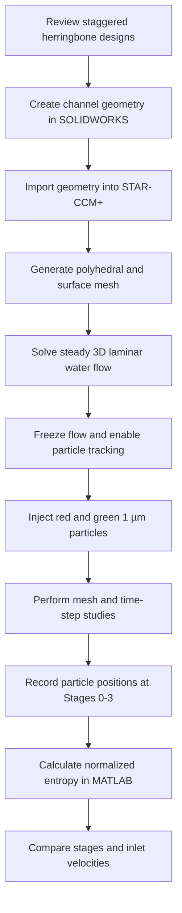
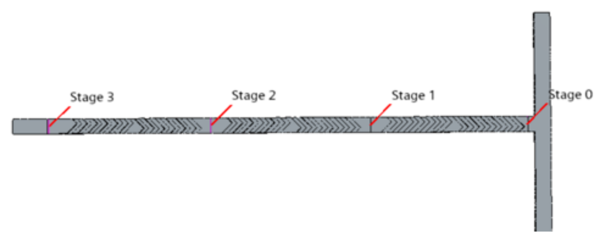
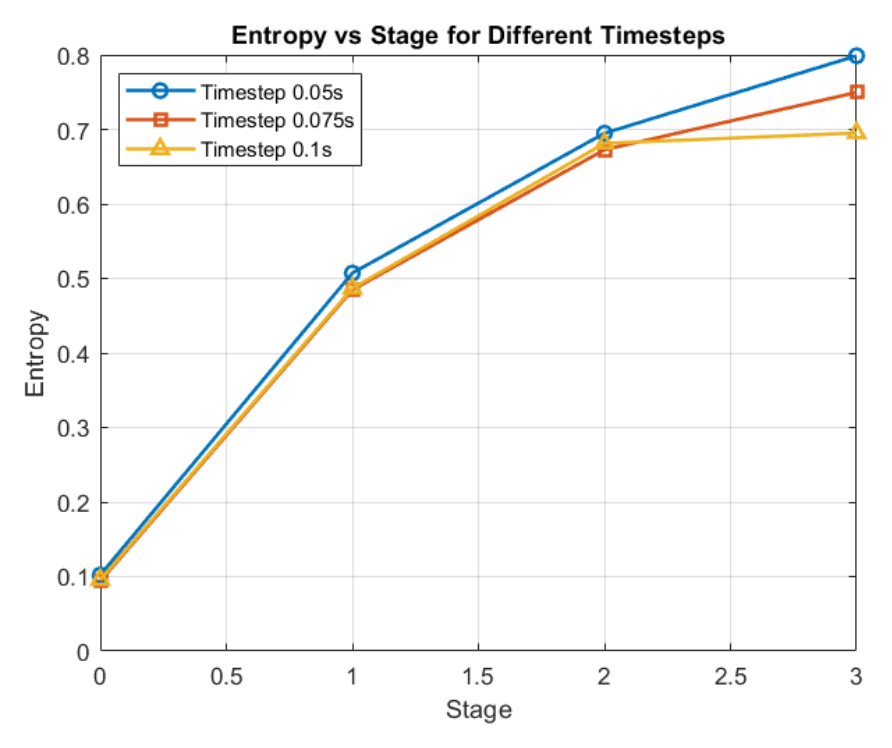
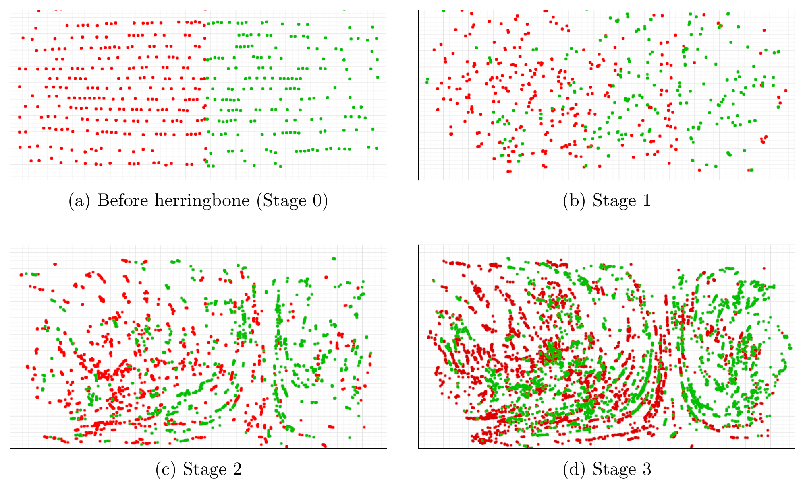

# Particle-Based Mixing Simulation in a Staggered Herringbone Microchannel

Three-dimensional CFD study of particle mixing in a staggered herringbone microchannel using laminar flow and Lagrangian particle tracking in **Simcenter STAR-CCM+ 2406**.

## Project Overview

This project investigates how staggered herringbone grooves enhance mixing between two initially segregated streams in a laminar microchannel. Red and green 1 µm particles were used as numerical tracers representing two species. Their trajectories were tracked through successive mixing stages, and the degree of mixing was quantified using normalized Shannon entropy.

The channel was designed in **SOLIDWORKS 2024**, simulated in **STAR-CCM+**, and analyzed using **MATLAB**. Mesh- and time-step-independence studies were completed before comparing mixing at inlet velocities of 0.001 and 0.005 m/s.

## Objectives

- Develop a three-dimensional model of a staggered herringbone micromixer.
- Track the downstream redistribution of two initially separated particle populations.
- Quantify mixing quality at successive stages using normalized mixing entropy.
- Determine whether changing the inlet velocity from 0.001 to 0.005 m/s substantially affects final mixing.

## Methodology

### 1. Channel Geometry

The rectangular microchannel contains two inlets, one outlet, and staggered herringbone grooves that generate transverse and swirling motion within the otherwise laminar flow. The numerical analysis used four observation locations: Stage 0 before the grooves and Stages 1-3 after successive mixing cycles.

| Parameter | Value |
|---|---:|
| Channel length | 26 mm |
| Channel width | 750 µm |
| Channel height | 250 µm |
| Groove width | 188 µm |
| Groove depth | 150 µm |
| Groove pitch | 376 µm |
| Groove intersection angle | 90° |
| Asymmetry factor | 0.67 |

  

### 2. Flow and Particle Models

The simulations used the following STAR-CCM+ physics models:

- Laminar flow
- Lagrangian multiphase model

Water was used as the continuous phase. Two Lagrangian particle phases represented the red and green species. Each particle was modeled as a **1 µm solid sphere** transported by the continuous flow. Particle-wall interactions were assigned a rebound condition with a restitution coefficient of **1**, corresponding to an ideal elastic rebound without sticking.

### 4. Solution Procedure

The Eulerian flow and Lagrangian particle calculations were performed sequentially:

1. The Lagrangian solver was initially frozen.
2. The segregated flow solver was run until the steady water-flow field converged.
3. The converged flow solution was frozen.
4. The Lagrangian solver was enabled.
5. The simulation was changed from steady to implicit unsteady.
6. Red and green particle trajectories were recorded at Stages 0-3.

For the 0.005 m/s case, 50 particles were injected every 0.2 s for 15 s. For the 0.001 m/s comparison case, 20 particles were injected every 0.2 s for 15 s.

### 5. Mixing-Entropy Calculation

The channel cross section at each observation plane was divided into spatial bins. A MATLAB routine counted red and green particles within each bin and calculated the conditional Shannon entropy of the species distribution:

$$
S_{\mathrm{mix}}=-\frac{1}{\ln C}
\sum_{j=1}^{M}p_j\sum_{c=1}^{C}p_{c|j}\ln\left(p_{c|j}\right)
$$

where `M` is the number of spatial bins, `C = 2` is the number of particle species, `p_j` is the probability of a particle occupying bin `j`, and `p_(c|j)` is the conditional probability of species `c` within that bin.

The entropy was normalized to range from 0 to 1:

- `S_mix = 0`: complete segregation
- `S_mix = 1`: ideal mixing

### 6. Mesh-Independence Study

A polyhedral volume mesher and surface remesher were used with surface and volume growth rates of **1.1**. Volumetric refinement was applied around the herringbone structures. Five mesh sizes were tested using water at an inlet velocity of **0.001 m/s**.

### 7. Time-Step-Independence Study

Time steps of **0.05, 0.075, and 0.1 s** were tested at an inlet velocity of **0.005 m/s**. Fifty particles were injected every 0.2 s for 15 s, and each simulation continued for 21 s.

Entropy increased from Stage 0 to Stage 3 for every tested time step. However, the 0.1 s time step underpredicted the Stage 3 entropy relative to the smaller time steps. The **0.05 s time step** produced the most consistent result and was therefore selected for the final simulations.

  

## Results and Discussion

### Evolution of Particle Mixing

Before the herringbone section, the red and green particles remained primarily separated because the two inlet streams flowed side by side under laminar conditions. After Stage 1, the grooves generated transverse motion and rearranged the fluid layers, causing the two particle populations to overlap. Mixing continued to improve through Stages 2 and 3 as repeated stretching, folding, and cross-sectional redistribution reduced segregation.

  

### Mixing Entropy at 0.005 m/s

| Location | Normalized entropy | Interpretation |
|---|---:|---|
| Stage 0 | 0.1021 | Streams remained strongly segregated |
| Stage 1 | 0.5073 | Substantial mixing began after one cycle |
| Stage 2 | 0.6949 | Particle redistribution continued |
| Stage 3 | **0.7989** | A high degree of mixing was achieved |

The entropy increased by **0.6968** between Stage 0 and Stage 3. More than half of the ideal normalized mixing level was reached after the first cycle, and the final entropy approached **0.8** after three cycles. The monotonic increase confirms that successive herringbone stages progressively enhanced particle redistribution.

## Key Findings

- The staggered herringbone geometry successfully redistributed two initially separated particle populations under laminar-flow conditions.
- Normalized mixing entropy increased from **0.1021 at Stage 0** to **0.7989 at Stage 3** for the 0.005 m/s case.
- One mixing cycle raised entropy above 0.5, while three cycles produced a final entropy close to 0.8.
- Increasing inlet velocity from 0.001 to 0.005 m/s produced slightly greater intermediate-stage entropy but little difference in final Stage 3 entropy.

**Main conclusion:** Successive staggered herringbone stages substantially improved particle mixing, while the tested change in inlet velocity had only a limited effect on the final mixing entropy.

## Limitations

- The particles were numerical surrogates for species or enzymes; experimental validation was outside the scope of the simulation.
- Only two inlet velocities were compared, so the result should not be generalized beyond the tested range.
- The mesh-independence assessment focused on velocity profiles at selected transverse locations.
- A wider range of time steps, velocities, particle sizes, and transport forces should be evaluated in future studies.
